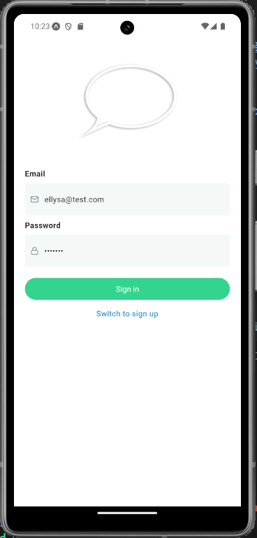
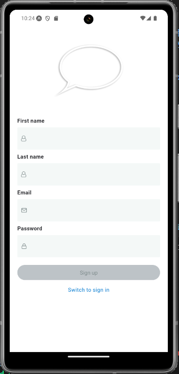
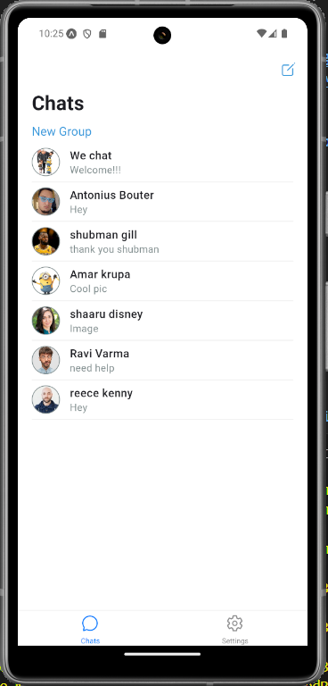
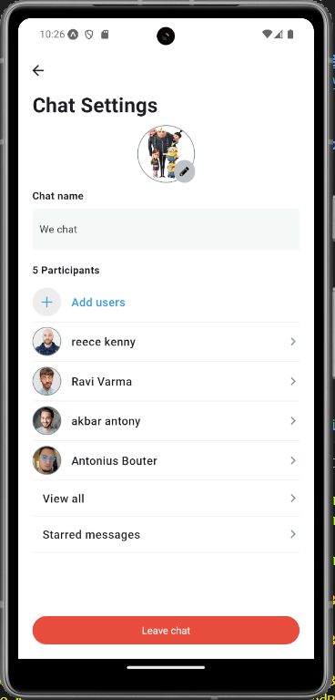
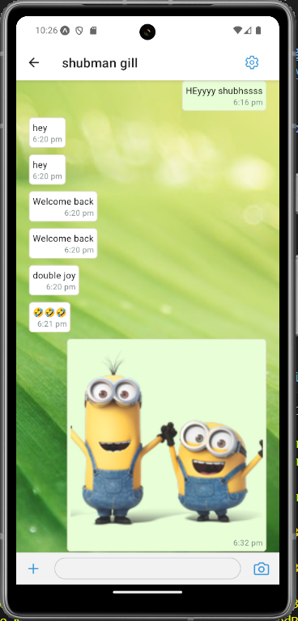
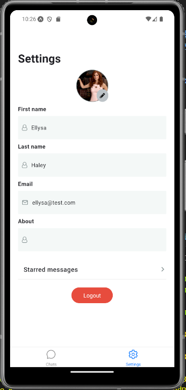
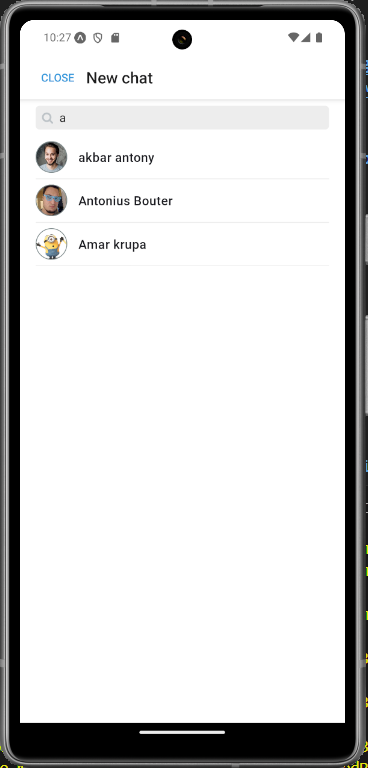
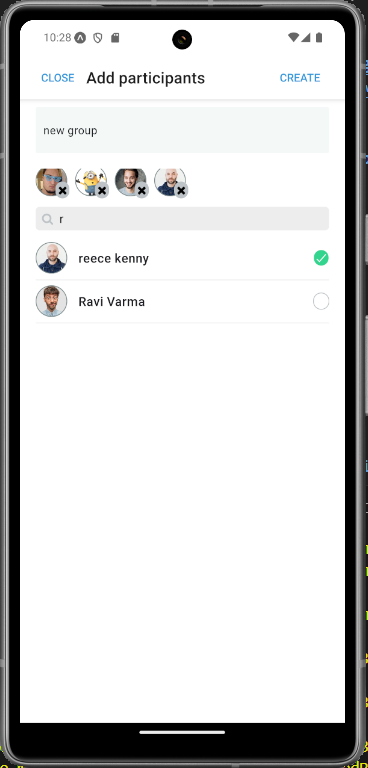
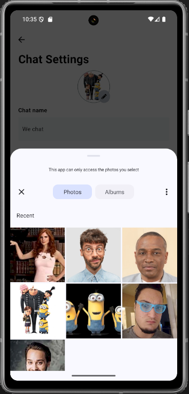

# Messenger Clone

# Video demo link - https://drive.google.com/file/d/18YcXh2I-FmmeZZcCqIH3dny46lx4dIxX/view?usp=drive_link

## Teh stack
## React native and firebase for database 

### Features
# Sign in page  - New user
# Sign up page  - Existing user
# Search the exisiting user to chat
# New group creating 
# Pic upload on both chat and wallpaper
# Send GIFs,chats and messages to one another
# Expo Notifications allowed when using two different emulators
# User Info page
# Starred meessages - retrieves users starred messages
# Leave chat and Log out functionalities

## sign up   --- sign in page
 

## Home screen   --- Chat info screen
  

## chat screen  ---  user info screen
  

## searchUesr screen --- create group screen
 

## image upload 

